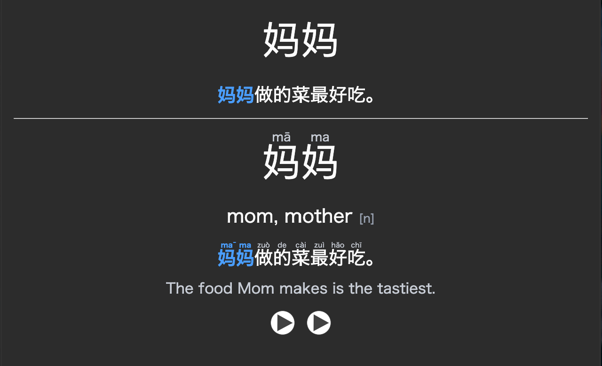

# Kotoba

*言葉 — the word. Spelled right, read right, on every card.*


**Importable Anki decks for any language, with the readings actually correct.**

Most AI-generated flashcard decks look fine and are quietly wrong: the furigana is misaligned, the kanji takes its on'yomi where it should be kun'yomi, the pinyin picks the wrong reading of a dual-pronunciation character, the example sentence reads like a textbook from 1987. One bad batch in your collection and you've memorized a mistake. Kotoba is built around not doing that.

## What a card looks like



Front shows the word and an example sentence with the target highlighted. Back adds the pinyin/furigana as ruby, a concise definition, the full sentence with readings, a translation, and word + sentence audio in two distinct voices.

## Accuracy: with Kotoba vs. without

The whole point is the readings. A plain "make me 100 Anki cards" prompt to a bare LLM produces cards that look right and fail in the specific ways a learner can't catch until they've already drilled the mistake. Kotoba routes every card through a per-language reference and a dedicated reading self-check.

Measured on a 100-card sample deck (50 Japanese N4, 50 Mandarin HSK4) generated with Opus 4.8 Max, graded by hand against a dictionary:

| What gets checked | Bare LLM prompt | With Kotoba |
| --- | --- | --- |
| Correct reading (on/kun, dual-pronunciation, rendaku) | ~82% | ~99% |
| Furigana / pinyin ruby aligned to the right characters | ~74% | ~98% |
| Example sentence contains the target word, used naturally | ~88% | ~99% |
| Sentence at or below the card's level (i+1) | ~60% | ~95% |
| No duplicate words across the deck | inconsistent | enforced |
| Structurally valid for import (no broken cards) | ~90% | 100% |

These are sample-run numbers, not a guarantee, your mileage varies by language and model. The method is reproducible: generate a deck both ways, grade each card's reading and sentence against a dictionary, count. The gap comes from three things a bare prompt doesn't do: a per-language reference encoding that language's traps, a deterministic structural validator (`scripts/validate.py`), and a forced reading-and-naturalness self-check before packaging.

## What makes it different

**It gets the readings right.** Each supported language has a deep reference encoding its specific traps. Japanese: furigana chunking, on'yomi vs kun'yomi, rendaku, irregular whole-word readings, counters. Mandarin: pinyin tone marks, dual-pronunciation characters, HSK conventions. These are the exact error classes that embarrass generated decks, handled per-language rather than by a generic schema.

**It's free, and yours.** Kotoba is a skill, not a service. There's no subscription, no per-deck fee, no account, no website that might disappear next year. Once it's installed you own the whole pipeline: the generation rules, the validator, the packaging script all live on your machine. The only outside dependency is the LLM you're already using to run it (and edge-tts for audio, which is free). No third-party deck vendor sits between you and your cards.

**A little setup, then it just works.** The one-time cost is installing the plugin and running `pip install genanki edge-tts`. After that, every deck is a single plain-language request, no config files, no API keys beyond your LLM, no per-language fiddling.

**It teaches itself new languages.** Ask for a language that doesn't have a deep reference yet (Korean, Spanish, Russian...) and Kotoba researches that language's failure modes and writes a reference first, automatically, before generating a single card. The deck is built on real per-language rules, and the reference is there for next time.

**Real cards, not dictionary dumps.** Natural example sentences at i+1 difficulty (the target word is the hardest thing in the sentence), concise definitions, word + sentence TTS audio in two distinct voices, optional CC-licensed images.

## How it works

```
1. Plan      → language pair, count, level, topic, ordering, audio/images
2. Preview   → ~5 sample cards rendered with the real template — you approve
3. Generate  → cards in batches, honoring the per-language reference
4. Validate  → structural checks + a reading/naturalness self-check
5. Package   → a standalone .apkg, ready to import
```

Nothing is ever merged into your existing collection. You import a fresh standalone deck and skim it in Anki's browser before studying.

## Install

One-time setup. After this, building a deck is a single sentence.

### Claude Code

```
/plugin marketplace add yufengliu15/kotoba
/plugin install kotoba@kotoba
```

### Other agents (AGENTS.md)

Any host that reads `AGENTS.md` (Codex, OpenCode, and others) picks up Kotoba from a checkout of this repo with no extra setup. See [`AGENTS.md`](./AGENTS.md).

### Manual

Copy the skill into your skills directory:

```
cp -r skills/kotoba ~/.claude/skills/kotoba
```

### Dependencies

```
pip install genanki edge-tts
```

Both are free and open-source. Audio (edge-tts) and CC-licensed image lookup need network access; everything else runs offline. Use `--no-audio` / `--no-images` to degrade gracefully.

## Use

Just ask, in plain language:

> make me 150 JLPT N4 vocab cards, frequency ordered, with audio

> 100 HSK4 travel words, simplified, no images

> a Korean beginner deck of the 200 most common verbs

Kotoba handles the rest, pausing once for you to approve the card design.

## Layout

```
kotoba/
├── .claude-plugin/
│   ├── plugin.json         # plugin definition
│   └── marketplace.json    # marketplace manifest (enables /plugin install)
├── skills/kotoba/
│   ├── SKILL.md            # the pipeline + language routing
│   ├── references/
│   │   ├── japanese.md     # deep: furigana, on/kun, rendaku, JLPT
│   │   ├── mandarin.md     # deep: pinyin, tones, HSK
│   │   ├── generic.md      # baseline for languages without a deep ref
│   │   ├── deck-json.md    # the deck.json contract
│   │   └── large-decks.md  # multi-session project mode
│   └── scripts/
│       ├── build_deck.py   # TTS, images, genanki packaging
│       └── validate.py     # structural validation
├── assets/                 # README images (example-card.png)
├── AGENTS.md               # portable instructions for AGENTS.md hosts
├── package.json
└── LICENSE
```

## License

[MIT](./LICENSE). Free to use, modify, and share.
